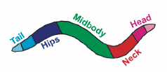
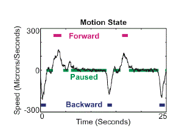
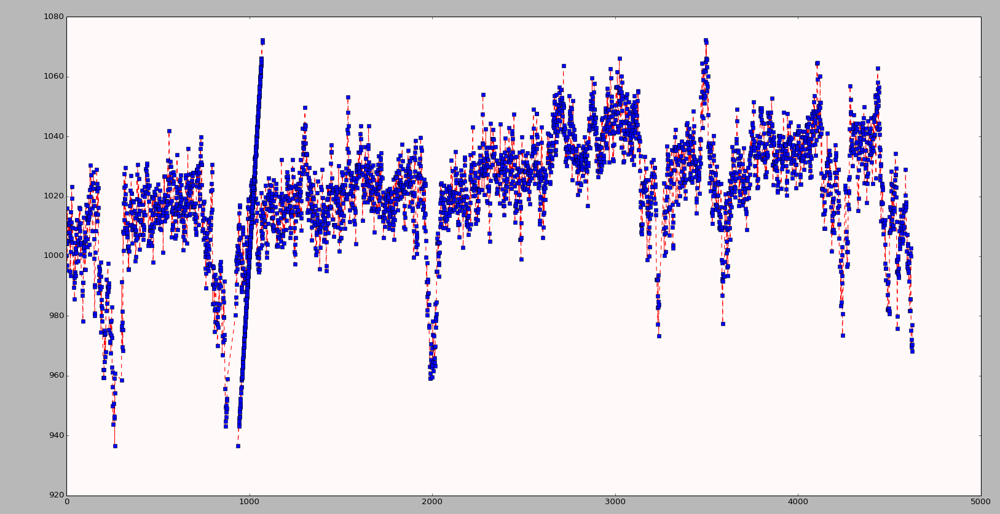
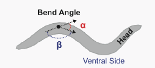
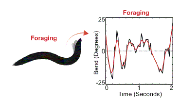
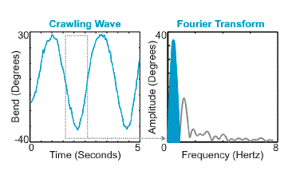

#Locomotion Features#
 
Credit for all Locomotion feature definitions: [Yemini *et al.* (2013)](http://www.nature.com/nmeth/journal/v10/n9/extref/nmeth.2560-S1.pdf) 

There are four locomotion features: bends, motion, turns, and velocity.  Here they are in the actual HDF5 file storing them:

 
###1. Velocity###

The worm’s velocity is measured at five places:

- the tip of the head ("headTip")
- the tip of the tail ("tailTip")
- the head
- the tail
- the midbody

*(The locations of the body parts used for feature computation: head, neck, midbody, hips, and tail. Each body part encompasses 1/6 of the worm (measured along the contour and skeleton, independently), save for the midbody which is 1/3. The head and tail are further split in half to create the head and tail tips, each 1/12 long.)*

**Which frames to use in velocity calculation**

At each frame of the video, we attempt to calculate an approximate *instantaneous* velocity, by by using a starting and ending frame some number of frames away from the frame in question: 

- The head tip and tail tips’ instantaneous velocity is measured at each frame using a 1/4 second up to a 1/2 second window. For each frame, we search for a start frame 1/4 of a second before and an end frame 1/4 second after to delineate the worm’s instantaneous path. If the worm’s location is not known within either the start or end frame, we extend the search for a known location up to 1/2 second in either direction. If the worm’s location is still missing at either the start or end, the velocity is marked unknown at this point.
- The head, midbody, and tail velocity are computed identically except they use a 1/2 second up to a 1 second window for choosing their start and end frames.

**The velocity calculation for each body part**

The figure above on the left is a simple diagram representing worm velocity and the crawling wave.  

The figure above on the right shows how the velocity vector of a body part is measured relative to the head-tail axis. In other words, the velocity, per body part, is the vector of its respective [centroid](http://en.wikipedia.org/wiki/Centroid).  Therefore, to fully characterize this vector, the velocity is composed of two parts:

1. The **speed** is defined as the distance between the centroids of the start and end frames (for the respective body parts) divided by the time between both frames. 

2. The **direction**, expressed as an [angular speed](http://en.wikipedia.org/wiki/Angular_speed).  Direction is defined as the angle (between centroids) from the start to the end frame, relative to the worm’s *overall body angle*, divided by the time between both frames. 
 
The worm’s **overall body angle** is defined as the mean orientation of the angles, in the tail-to-head direction, between subsequent midbody skeleton points. The body angle is used to sign the velocity.

If the head or tail tip’s start-to-end angle exceeds 90°, clockwise or anti-clockwise, relative to the overall worm body angle, the motion is towards the tail. In this case both the speed and direction are negatively signed.  That is, the velocity is signed negatively whenever the respective body part moves towards the tail (as opposed to the head). 

###2. Motion States###

The worm’s forward, backward, and paused motion states attempt to differentiate these event states unambiguously:

.

*A 25 second window of worm motion reveals 2 forward, 3 backward, and roughly 5 paused events. A short, small peak (between the second and third pauses) that may have been forward motion, remains unclassified due to ambiguity.*

Therefore, ambiguous motion has no associated state. 

The motion states are computed from the worm’s **velocity** (described above) and **length** (described in the section on “[Morphology](morphology.md)”). Missing lengths are linearly interpolated between segmented frames. 

*Example of interpolated skeleton lengths:*

*Code to generate the above plot:*

    def get_motion_codes(midbody_speed, skeleton_lengths):
		...  
		#  Interpolate the missing lengths.
		skeleton_lengths_interpolated = \
	    	interpolate_with_threshold(skeleton_lengths, 
	       		config.LONGEST_NAN_RUN_TO_INTERPOLATE)
    
		plt.plot(list(enumerate(skeleton_lengths_interpolated)), 
	   			 skeleton_lengths_interpolated, 'r--',
	   			 list(enumerate(skeleton_lengths)), skeleton_lengths, 'bs',)
	  	plt.show()
		...

(The following filtering criteria were chosen based on human labeling of events within a variety of N2 and mutant videos:)

- The worm is defined in a state of **forward motion** when a period, more than half a second long, is observed wherein: 
	- a) the worm travels at least 5% of its mean length over the entire period; and, 
	- b) the worm’s speed is at least 5% of its length, per second, in each frame. The worm must maintain this speed almost continuously with permissible interruptions of, at most, a quarter second (this permits quick contradictory movements such as head withdrawal, body contractions, and segmentation noise). 
- The criteria for **backward motion** is identical except the worm must be moving backwards (the midbody speed must be negatively signed). 
- The worm is defined in a **paused state** when a period, more than half a second long, is observed wherein the worm’s forward and backward speed do not exceed 2.5% of its length, per second, in each frame. The worm must observe these speed limits almost continuously with permissible interruptions of, at most, a quarter second (once again, this permits quick contradictory movements).

###3. Bends###

As shown in the file structure image above, in the feature file itself, The "bends" feature has four sub-features, "foraging", "head", "midbody", "tail".  The latter three are grouped in the below description of crawling, whereas the first sub-feature is described separately.

The bend angle (α) is the difference in tangent angles at each point; or, alternatively phrased, the supplementary angle (α) with respect to the angle formed by any three consecutive points (β). The bend angle is signed negatively whenever the ventral side is concave within the bend (as is the case for the bend shown).

#### Bends sub-feature: Foraging ####

Worm foraging is expressed as both an amplitude and an angular speed:

*Worm foraging is measured from the bend angle between the two sections of the head (panel a). The noisy signal (black) is smoothed (red) by convolving with a Gaussian. The foraging amplitude is defined as the largest foraging bend angle measured, prior to crossing 0°. Foraging speed is simply the angular speed. Ventral and dorsal foraging is present within the first 1 second of the trace. The latter half of the trace displays the difficulties associated with measuring signal above the noise. At nearly 1 second in, the nose appears to quickly cross ventrally before rebounding dorsally. Smoothing eliminated the associated sign change in amplitude; although, a small, nearly 0° ventral amplitude may well be considered noise.*

Foraging is signed negatively whenever it is oriented towards the ventral side. In other words, if the nose is bent ventrally, the amplitude is signed negatively. Similarly, if the nose is moving ventrally, the angular speed is signed negatively. As a result, the amplitude and angular speed share the same sign roughly only half the time. Foraging is an ambiguous term in previous literature, encompassing both fine movements of the nose as well as larger swings associated with the head. Empirically we have observed that the nose movements are aperiodic while the head swings have periodicity. Therefore, we measure the aperiodic nose movements and term these foraging whereas the head swings are referred to as measures of head crawling (described earlier in this section). 
Foraging movements can exceed 6Hz and, at 20-30fps, our video frame rates are just high enough to resolve the fastest movements. By contrast, the slowest foraging movements are simply a continuation of the crawling wave and present similar bounds on their dynamics. Therefore, we bound foraging between 1/30Hz (the lower bound used for crawling) and 10Hz. 

To measure foraging, we split the head in two (skeleton points 1-4 and 5-8) and measure the angle between these sections. To do so, we measure the mean of the angle between subsequent skeleton points along each section, in the tail-to-head direction. The foraging angle is the difference between the mean of the angles of both sections. In other words, the foraging angle is simply the bend at the head. 

Missing frames are linearly interpolated, per each skeleton point, for fragments up to 0.2 seconds long (4-6 frames at 20-30fps – twice the upper foraging bound). When larger fragments are missing, foraging is marked undefined. Segmentation of the head at very small time scales can be noisy. Therefore, we smooth the foraging angles by convolving with a Gaussian filter 1/5 of a second long (for similar reasons to those mentioned in frame interpolation), with a width defined by the Matlab “gausswin” function’s default a of 2.5 and normalized such that the filter integrates to 1. 

The foraging amplitude is defined as the largest foraging angle measured, prior to crossing 0°. In other words, the largest nose bend prior to returning to a straight, unbent position. Therefore, the foraging amplitude time series follows a discrete, stair-step pattern. The amplitude is signed negatively whenever the nose points towards the worm’s ventral side. The foraging angular speed is measured as the foraging angle difference between subsequent frames divided by the time between these frames. To centre the foraging angular speed at the frame of interest and eliminate noise, each frame is assigned the mean of the angular speed computed between the previous frame and itself and between itself and the next frame. The angular speed is signed negatively whenever its vector points towards the worm’s ventral side. 

**Note from Ev Yemini on Setup Options:**

Empirically I've found the values below achieve good signal.

Furthermore, Huang et al. in 2006, measure foraging frequencies for several worms and find the signal centered at roughly 4Hz. For N2 worms, they see a second signal at 10Hz but I find this value too close to the background noise present in segmentation. Visually inspecting the foraging signal, as the bend between the nose and neck, corroborates a roughly 4Hz signal. But, foraging usually encompasses only half to a quarter cycle. In other words, the worm bends it nose sharply and sometimes bends it back but a full wave, akin to a body bend, occurs far less frequently. Therefore I chose to measure angular speed for foraging.  

#### Bends sub-features (for crawling): "head", "midbody", "tail" ####

Worm crawling is expressed as both an amplitude and frequency:

*A crawling wave is represented as the sinusoidal wave of the bend angle at its associated body part. Note the dorsal-ventral asymmetry both in the amplitude and in the wavelength itself. The dotted window encloses a waveform used to measure an instantaneous crawling wave. The Fourier transform of the waveform reveals a strong peak. This peak defines the instantaneous crawling amplitude and frequency.*

We measure these features instantaneously at the head, midbody, and tail. The amplitude and frequency are signed negatively whenever the worm’s ventral side is contained within the concave portion of its instantaneous bend. 

Crawling is only measured during forward and backward motion states. The worm bend mean angles (described in the section on “[Posture](Posture.md)”) show a roughly periodic signal as the crawling wave travels along the worm’s body. This wave can be asymmetric due to differences in dorsal-ventral flexibility or simply because the worm is executing a turn. Moreover the wave dynamics can change abruptly to speed up or slow down. Therefore, the signal is only roughly periodic and we measure its instantaneous properties. 

Worm bends are linearly interpolated across unsegmented frames. The motion states criteria (described earlier in this section) guarantee that interpolation is no more than 1/4 of a second long. For each frame, we search both backwards and forwards for a zero crossing in the bend angle mean – the location where the measured body part (head, midbody, or tail) must have hit a flat posture (a supplementary bend angle of 0°). This guarantees that we are observing half a cycle for the waveform. Crawling is bounded between 1/30Hz (a very slow wave that would not resemble crawling) and 1Hz (an impossibly fast wave on agar). If the window between zero crossings is too small, the nearest zero crossing is assumed to be noise and we search for the next available zero crossing in its respective direction. If the window is too big, crawling is marked undefined at the frame. Once an appropriate window has been found, the window is extended in order to center the frame and measure instantaneous crawling by ensuring that the distance on either side to respective zero crossings is identical. If the distances are not identical, the distance of the larger side is used in place of the zero-crossing distance of the smaller side in order to expand the small side and achieve a symmetric window, centered at the frame of interest. 
We use a Fourier transform to measure the amplitude and frequency within the window described above. The largest peak within the transform is chosen for the crawling amplitude and frequency. If the troughs on either side of the peak exceed 1/2 its height, the peak is rejected for being unclear and crawling is marked as undefined at the frame. Similarly, if the integral between the troughs is less than half the total integral, the peak is rejected for being weak. 

###5. Turns###

**Omega** and **upsilon** turn events are computed similarly to a previously described method [("Machine-vision-based detection of omega bends and reversals in *C. elegans*" by Huang et. al, also of the Schafer Lab (2006))](http://www2.mrc-lmb.cam.ac.uk/groups/wschafer/Huang2006.pdf) but using skeleton bends instead of a single head-midbody-tail angle. Omega and upsilon turns are signed negatively whenever the worm’s ventral side is sheltered within the concavity of its midbody bend. 

The worm bends (described in the section on “[Posture](Posture.md)”) are used to find a contiguous sequence of frames (interruptible by coiling and other segmentation failures) wherein a large bend travels from the worm’s head, through its midbody, to its tail. The worm’s body is separated into three equal parts from its head to its tail. The mean supplementary angle is measured along each third. 
- For **omega** turns, this angle must initially exceed 30° at the first but not the last third of the body (the head but not the tail). The middle third must then exceed 30°. And finally, the last but not the first third of the body must exceed 30° (the tail but not the head). This sequence of a 30° mean supplementary angle, passing continuously along the worm from head to tail, is labeled an omega turn event. 
- **Upsilon** turns are computed nearly identically but they capture all events that escaped being labeled omega turns, wherein the mean supplementary angle exceeded 15° on one side of the worm (the first or last third of the body) while not exceeding 30° on the opposite end. 
