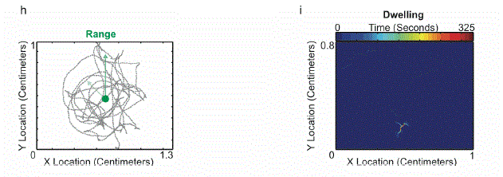

#Path Features#
 

###1. Range###
 
The centroid of the worm’s entire path is computed. The range is defined as the distance of the worm’s midbody from this overall centroid, in each frame (Supplementary Fig. 1h). 

###2. Dwelling###

The worm dwelling is computed for the head, midbody, tail, and the entire worm (Supplementary Fig. 1i). The worm’s width is assumed to be the mean of its head, midbody, and tail widths across all frames. The skeleton’s minimum and maximum location, for the x and y axes, is used to create a rectangular boundary. This boundary is subdivided into a grid wherein each grid square has a diagonal the same length as the worm’s width. When skeleton points are present on a grid square, their corresponding body part is computed as dwelling within that square. The dwelling for each grid square is integrated to define the dwelling distribution for each body part. For each body part, untouched grid squares are ignored. 

###3. Curvature###

The path curvature is defined as the angle, in radians, of the worm’s path divided by the distance it traveled in microns. The curvature is signed to provide the path’s dorsal-ventral orientation. When the worm’s path curves in the direction of its ventral side, the curvature is signed negatively. 

The worm’s location is defined as the centroid of its body, with the head and tail removed (points 9-41). We remove the head and tail because their movement can cause large displacements in the worm’s centroid. For each frame wherein the worm’s location is known, we search for a start frame 1/4 of a second before and an end frame 1/4 second after to delineate the worm’s instantaneous path. If the worm’s location is not known within either the start or end frame, we extend the search for a known location up to 1/2 second in either direction. If the worm’s location is still missing at either the start or end, the path curvature is marked unknown at this point. 
With three usable frames, we have an approximation of the start, middle, and end for the worm’s instantaneous path curvature. We use the difference in tangent angles between the middle to the end and between the start to the middle. The distance is measured as the integral of the distance traveled, per frame, between the start and end frames. When a frame is missing, the distance is interpolated using the next available segmented frame. The instantaneous path curvature is then computed as the angle divided by the distance. This path curvature is signed negatively if the angle curves in the direction of the worm’s ventral side. 
